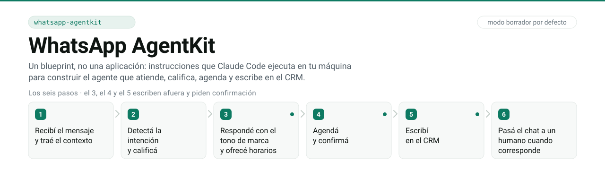

<picture>
  <source media="(prefers-color-scheme: dark)" srcset="assets/hero-oscuro.svg">
  <source media="(prefers-color-scheme: light)" srcset="assets/hero-claro.svg">
  
</picture>

# WhatsApp AgentKit

Alguien te escribe a las once de la noche preguntando cuánto sale. Le contestás a las nueve de
la mañana y ya compró en otro lado. O le contestás bien, cerrás la reunión, y tres días después
nadie sabe en qué quedaron: no hay etapa, no hay resumen, no hay próximo paso escrito en ningún
lado. Cuando el volumen sube, las dos cosas pasan el mismo día.

Este kit construye el agente que atiende esos chats: califica, contesta la objeción con tu
playbook, ofrece horarios que existen de verdad, agenda, y deja la etapa y el próximo paso
escritos en el CRM.

## Mirálo trabajar antes de leer nada

Sin instalar, sin clave de API, sin registrarte. Diez segundos:

```console
$ python3 pruebas/simulador.py
cerrador · demo · modo borrador · base en memoria · modelo stub, sin ANTHROPIC_API_KEY

vos> Si me hacés 30 % lo tomo hoy mismo

agente (escalado · NO enviado)
  Te sigue una persona del equipo. Ya le pasé la conversación.

  ── por qué ───────────────────────────────────────────────────
  score 62 · tibio       Preguntó precio y puso una objeción que está en el playbook.
  objeción «Está caro»   en el playbook · respondida con su línea
  horarios 0 de 4        de disponibilidad · ninguno inventado
  precio 12000 MXN       del catálogo · dentro del rango 8000–40000
  handoff precio_fuera_de_rango    disparador «30»
  envíos de este turno   0
  ──────────────────────────────────────────────────────────────
  enter aprueba y manda · n descarta
```

Le pidieron un 30 % de descuento y **no lo dio**: lo pasó a una persona. No inventó un horario,
no inventó un precio, contestó la objeción con la línea del playbook, y no mandó nada sin que
alguien le diera al enter.

Eso es lo que hace, y eso es lo que te llevás:

| lo que no puede hacer | lo que ganás vos |
|---|---|
| Regalar un descuento por su cuenta | No amanecés con tu margen regalado |
| Inventarse un horario | La agenda no se llena de reuniones que no existen |
| Inventarse un precio | Nadie cotiza tu trabajo por vos |
| Improvisar una objeción | Contesta con tus palabras, no con las de un modelo |
| Escribirle a un cliente sin tu visto bueno | No habla en tu nombre a tus espaldas |
| Cerrar un chat sin dejar rastro | Tres días después se sabe en qué quedaron |

Contestás al instante sin que nadie diga una tontería en tu nombre.

### Esto no es para vos si…

Seamos claros, porque te vas a ahorrar la tarde:

- **Querés un bot que conteste solo y te olvidás.** Este no. Redacta y espera tu enter. Podés
  soltarlo a automático cuando vos quieras, y esa decisión es tuya, no viene de fábrica.
- **Querés que cierre a cualquier precio.** Este escala en vez de regatear. Si tu estrategia
  es dar el 30 % con tal de firmar hoy, sale más barato un bot cualquiera.
- **Querés instalarlo en tres clics sin tocar nada.** Hay que escribir tu catálogo, tu playbook
  y tu disponibilidad. Un agente que no sabe qué vendés se lo inventa, y ahí empieza el
  problema.
- **No tenés a nadie que mire los borradores los primeros días.** Sin eso no es más rápido:
  es igual de lento y encima con un paso más.

Y es para vos si preferís **perder un lead antes que quedar mal con uno bueno**. Todo lo de
arriba es la misma decisión repetida: el agente no dice nada que vos no puedas sostener.

## Los seis pasos

Son el contrato, y están así en `CLAUDE.md`:

```
1 · Recibí el mensaje y traé el contexto
2 · Detectá la intención y calificá
3 · Respondé con el tono de marca y ofrecé horarios   ← le escribe a una persona
4 · Agendá y confirmá                                  ← escribe en la agenda
5 · Escribí en el CRM                                  ← escribe en la base
6 · Pasá el chat a un humano cuando corresponde
```

El paso 1 baja el audio y lo transcribe con Whisper, y la imagen la lee el mismo modelo de
Anthropic que ya está configurado: no hay una credencial de visión que conseguir. El paso 2
califica presupuesto, urgencia y encaje. El paso 3 sólo contesta objeciones que estén en tu
playbook; a las que no están las nombra y te las deja. El paso 6 corta cuando aparece enojo, un
precio fuera de rango o una palabra de escalación, y avisa por el canal interno.

El paso 4 agenda con Google Calendar por las dos formas de credencial, y el `type` del JSON
decide cuál. `authorized_user` es tu propia cuenta: se consigue en cinco minutos y se cae el día
que cambiés la contraseña o te vayas de la empresa. `service_account` es un usuario que es un
programa y no una persona: sobrevive a las dos cosas, y a cambio hay que compartirle el
calendario a mano una vez. Para un negocio va `service_account`.

`pasos` sale con **seis elementos siempre**, aunque cinco queden salteados. El esquema lo
exige (`minItems: 6`, `maxItems: 6`) y por eso se ve dónde se cortó el ciclo, en vez de tener
que adivinarlo.

### El modo por defecto es `borrador`

Los pasos 3, 4 y 5 escriben afuera: mandan un mensaje a una persona, crean un evento en tu
calendario, tocan una fila de tu base. En `borrador` los tres redactan, muestran lo que harían,
y **esperan confirmación explícita**. Es el default del contrato de entrada:

```json
"modo": { "enum": ["borrador", "automatico"], "default": "borrador" }
```

Pasarlo a `automatico` lo decide quien instala, con `/soltar`, y de a un paso por vez. El
agente nunca se lo cambia solo.

Las pruebas lo sostienen: hay aserciones que llaman a los pasos que escriben **sin confirmar**
y exigen que no pase nada. Mandar el mensaje sin confirmación es fallo aunque el texto esté
perfecto.

## Con qué habla y dónde corre

**Dos proveedores de WhatsApp.** `meta`, la API de WhatsApp Business Cloud, con firma
`X-Hub-Signature-256` y prefijo `sha256=`. `zernio`, la pasarela sobre Meta, base
`https://zernio.com/api/v1`, con firma `X-Zernio-Signature` en hex minúscula y sin prefijo, y
la identidad del contacto anclada en el `businessScopedUserId` y no en el teléfono. Hay un
tercero para probar: `demo` no pide credenciales y no es un transporte falso, reproduce
entregas grabadas con los mismos bytes crudos y la misma cabecera de firma.

**Dos lugares donde corre.** Local —tu laptop para la primera entrega, un Mac Mini si ya está
prendido y la base con los chats no puede salir de la oficina— o Railway, que es el default del
blueprint. La elección la hace quien instala, no el agente.

**Una bandeja con API y webhooks.** El servicio expone diez rutas y once métodos, porque
`/webhook/{proveedor}` comparte camino entre el GET del alta y el POST de las entregas. Las
otras: `/salud`, que devuelve 200 siempre con la lista de lo que falta; `/panel`, el HTML sin
build ni CDN; y siete de `/api/` detrás de `PANEL_TOKEN` —conversaciones, una conversación por
id, leads, pendientes, aprobar, rechazar, y `/api/webhooks-salientes`, que da de alta un
destino firmado—. Aprobar un pendiente no manda el borrador guardado: vuelve a correr el paso
con `confirmado: true`.

### Las variables

Son dieciocho. La lista de nombres sale de un comando, así que no se copia a mano:

```bash
grep -E '^[A-Z_]+=' env.example | cut -d= -f1
```

Acá van sólo los nombres. Los valores viven en tu `.env`, que está en `.gitignore` y ahí se
queda. `env.example` trae de dónde se saca cada uno y con cuál se confunde.

| Bloque | Variables |
|---|---|
| El núcleo, siempre | `ANTHROPIC_API_KEY`, `MODELO`, `WHATSAPP_PROVIDER` |
| Meta, sólo con `WHATSAPP_PROVIDER=meta` | `WHATSAPP_TOKEN`, `WHATSAPP_PHONE_NUMBER_ID`, `WHATSAPP_VERIFY_TOKEN`, `META_APP_SECRET` |
| Zernio, sólo con `WHATSAPP_PROVIDER=zernio` | `ZERNIO_API_KEY`, `ZERNIO_WEBHOOK_SECRET`, `ZERNIO_ACCOUNT_ID` |
| Google Calendar, el paso 4 | `GOOGLE_CALENDAR_ID`, `GOOGLE_SERVICE_ACCOUNT_JSON` |
| Supabase, el CRM del paso 5 | `SUPABASE_URL`, `SUPABASE_SERVICE_KEY` |
| Audio entrante | `OPENAI_API_KEY` |
| El aviso del paso 6 | `SLACK_WEBHOOK_URL` |
| Despliegue y panel | `DATABASE_URL`, `PANEL_TOKEN` |

`PORT` no está en esa lista y no es un olvido: va comentada, porque Railway la inyecta y el
valor cambia en cada despliegue.

Sólo `ANTHROPIC_API_KEY` hace falta siempre, también en `demo`: lo que el demo se ahorra son
las credenciales de WhatsApp, no el modelo que redacta. Los bloques de Meta y de Zernio son
excluyentes. Sin ninguna credencial de WhatsApp el agente arranca igual con `demo`, dice qué le
falta, y corre los pasos 1 a 3 en borrador.

## Los comandos

Viven en `.claude/skills/`. Los que construyen abren el archivo de `blueprint/` que les toca;
`/revisar` no abre ninguno, porque lo único que hace es correr la compuerta.

| Comando | Qué hace |
|---|---|
| `/start` | de un clon recién bajado a un cerrador andando: mide el terreno, dice lo que cuesta y lo que tarda, entrevista, construye y despliega local o en Railway. Es la primera corrida |
| `/armar-cerrador` | construye el cerrador entero, fase por fase. `/start` recorre los mismos archivos, con el arranque y el cierre alrededor; éste sigue aparte para quien ya sabe dónde está parado |
| `/seguir` | retoma una construcción a medias: reconcilia el estado contra el disco antes de escribir |
| `/configurar` | las preguntas 5 a 9: catálogo, rango de precio, disponibilidad, escalación y canal interno |
| `/playbook` | escribe o cambia el playbook de objeciones y el tono, sin tocar nada más |
| `/conectar` | agrega, cambia o rota una credencial, incluido pasar de un proveedor a otro |
| `/probar` | abre el simulador de chat en la terminal y corre el caso contra `demo`, sin credenciales |
| `/revisar` | corre la compuerta y te dice qué falta antes de publicar |
| `/publicar` | despliega local o en Railway y da de alta el webhook contra tu proveedor |
| `/bandeja` | los borradores de a uno, con su panel de razonamiento: `va`, `no`, `corregí`, `saltar` |
| `/soltar` | pasa un paso de `borrador` a `automatico`, después de mostrarte los números |

`bandeja resumen` lista **las objeciones que aparecieron y no están en el playbook**. Ése es el
producto del comando: convierte dos semanas de esperar en dos semanas de construir el playbook.

## Esto no es una aplicación

**Adentro no hay código que corras.** No hay `agente/`, no hay servidor, no hay `pip install`
que te deje algo andando. Comprobalo:

```console
$ ls agente
ls: agente: No such file or directory
```

Lo que se envía son instrucciones, contratos, pruebas y una compuerta. Se clona, se abre Claude
Code adentro de la carpeta, y se corre `/start`. Claude lee el blueprint fase por fase y
**escribe el código en tu máquina**, contra tus versiones y tu sistema operativo.

La razón es de ingeniería y no de estilo: un `pip install` a veces no anda, y no anda distinto
en cada computadora. Un blueprint que dice qué hacer, qué tenés que ver en pantalla, y qué
hacer cuando eso no aparece, sobrevive a esa diferencia. Un tarball de código, no.

```bash
git clone https://github.com/julian-najas/whatsapp-agentkit
cd whatsapp-agentkit
claude          # y adentro:  /start
```

**Se clona, no se instala con `/plugin install`.** `.claude-plugin/plugin.json` existe para que
el marketplace pueda listarlo, y declara cero componentes a propósito: los once comandos leen
`blueprint/`, `scripts/` y `pruebas/` con `${CLAUDE_PROJECT_DIR}`, y eso son los archivos del
clon. Instalado como plugin, esas rutas apuntan al proyecto de otro.

Lo que se necesita antes: Python en el rango de `PINES.md` (`>=3.11,<3.15`) y una clave de la
API de Anthropic. Lo demás lo pide el blueprint cuando le toca.

### Qué hay en la caja

| Carpeta | Qué es |
|---|---|
| `blueprint/` | dieciséis archivos, uno por fase. Cada paso trae Objetivo, Hacé esto, Tenés que ver, Si falla |
| `contratos/` | entrada y salida en JSON Schema. `additionalProperties: false` en los dos niveles |
| `pruebas/` | la suite y los fixtures crudos, incluidas dos entregas grabadas con su firma |
| `plantillas/` | los archivos que se copian verbatim, cada uno con su sha256 en `MANIFIESTO.json` |
| `.claude/skills/` | los once comandos |
| `scripts/auditar.py` | la compuerta: veintitrés chequeos, sin red y sin credenciales |
| `PINES.md` | las 30 dependencias, el modelo y la imagen. Ningún número vive en dos lados |

## Cómo se verifica

`scripts/auditar.py` es la compuerta. Veintitrés chequeos mecánicos —cada uno sale 0 o 1, o es
una aserción sobre un archivo; ninguno dice «revisá el código»— y tres veredictos: `pass` sale
0, `fail` sale 2, `parcial` sale 3.

**No abre un socket ni lee un secreto**, y eso es la condición para que exista: un chequeo que
intente alcanzar a Meta con mala conexión se queda esperando un timeout de TCP y ahí no hay
reporte. Todo subproceso que lanza va con timeout y con las variables que parecen secreto sacadas
del entorno.

Mira el blueprint contra el árbol, las plantillas contra su sha256, los pines y el modelo, los
imports contra las distribuciones fijadas, siete patrones de credencial, que un solo cliente
HTTP tenga `timeout=`, que ninguna URL de mensajería viva fuera de `agente/enviar.py`, que las
salidas validen contra el contrato y que el validador **rechace** las mutaciones que tiene que
rechazar, que las firmas den contra los dos fixtures crudos, que toda ruta de `/api/` esté
detrás del token, y que la suite corra.

El chequeo 23 es el que mira a las pruebas y no al código: corre la suite una vez por campo del
contrato de salida, cambia **un solo** valor por otro que valida contra el mismo esquema, y
pregunta si algún nodo se pone rojo. Un test que sólo valide el documento contra el esquema no
afirma nada, y esto es lo que lo detecta. Sobre un build dio `40 afirmado · 3 no_mutable`: los
tres son los que el esquema ya fija, y ninguno de los 43 quedó sin aserción.

`parcial` es el veredicto que importa entender: no encontró nada, y algo que tenía que correr
no corrió. Un chequeo salteado no es un chequeo aprobado, y con `agente/` en el árbol un
salteo deja el veredicto en `parcial` y no se publica.

### Lo que da recién clonado

Un clon no trae `.venv/` ni `requirements.txt`. Los dos están en `.gitignore` porque los
escribe `blueprint/10-entorno.md`, así que hay **dos momentos** y no dan lo mismo.

**Recién clonado, con el Python que ya tengas.** La compuerta corre igual y degrada diciendo
por qué:

```console
$ python3 scripts/auditar.py
auditar: PARCIAL · 0 errores · 0 avisos · 14 salteados
  parcial: contrato-control tenía que correr en este árbol y salteó.
```

`parcial` acá es lo correcto y no es un problema tuyo: tres chequeos no tienen con qué correr
en ese intérprete y lo dicen en vez de darse por aprobados —`11 wire-schema` sin pydantic,
`17 contrato-control` sin jsonschema y `19 pruebas` sin pytest—. Son los tres que se suman a
los once legítimos, y por eso los salteados son 14. No hace falta que corras esto; está para
que si lo corrés, sepas qué estás viendo.

**Después de `blueprint/10-entorno.md`**, que es lo que corren `/start` y `/armar-cerrador` antes
de construir.
A mano son tres comandos —`blueprint/10-entorno.md` los trae para macOS, Linux, WSL, PowerShell
y Git Bash—:

```bash
python3 -m venv .venv
cp plantillas/infra/requirements.txt requirements.txt
.venv/bin/python -m pip install -r requirements.txt
```

Y ahí sí, todavía sin construir nada y sin un `.env` en el árbol:

```console
$ .venv/bin/python scripts/auditar.py
auditar: PASS · 0 errores · 1 aviso · 11 salteados
  un salteado no es un aprobado: leé el motivo de cada uno.

$ .venv/bin/python -m pytest pruebas -q
50 passed, 203 skipped
```

Los once salteados y los 203 tests salteados esperan el build: `agente/` todavía no existe, y
no hay qué mirar. Corré los dos comandos vos: si te dan otra cosa, es tu árbol el que tiene
algo, no este renglón. Estos mismos dos los corre GitHub en cada push, con la versión de
Python que fija `PINES.md`: [`.github/workflows/compuerta.yml`](.github/workflows/compuerta.yml).

Sobre un árbol construido los números son otros, y ésos no los podés verificar acá porque acá
no hay build. Lo que el repo deja anotado, con el archivo al lado: `199 passed` con la
compuerta en `PASS · 0 errores · 0 avisos · 0 salteados`, en `blueprint/30-generacion.md` y
`blueprint/35-panel-api.md`; `217 passed`, `231 passed` y `253 passed`, en `PENDIENTES.md`. La
corrida de `253` es la que midió los 43 campos del contrato de salida.

## Lo que no hace, y por qué

- **No inventa precios ni promociones.** Lo que no está en el catálogo que le pasás, no existe.
- **No contesta objeciones fuera del playbook.** Las nombra y las deja para vos.
- **No escribe primero.** Contesta a quien le escribió. Nada de envíos masivos ni de abrir
  conversaciones frías: eso es lo que hace que Meta te baje el número.
- **No negocia un precio fuera de rango.** Eso escala, siempre.
- **No sigue contestando después de una escalación.** Ni para despedirse.
- **No borra ni reordena nada del CRM.** Agrega y actualiza la fila del contacto.

Un límite que no pone el agente sino la plataforma: fuera de la ventana de 24 horas desde el
último mensaje del contacto, WhatsApp sólo deja mandar plantillas aprobadas. El recordatorio de
la cita cae casi siempre afuera de esa ventana, así que necesita una plantilla dada de alta con
tiempo.

## Los límites, dichos acá

Están enteros en [`PENDIENTES.md`](PENDIENTES.md) y en [`SUPUESTOS.md`](SUPUESTOS.md). Los que
conviene saber antes de clonar:

**El recordatorio de 24 horas anda con SQLite y con Postgres.** El jobstore de APScheduler es
síncrono y pide la URL sin `+asyncpg`; el driver síncrono que esa URL necesita,
`psycopg2-binary`, está fijado en `PINES.md` y en `plantillas/infra/requirements.txt`. En el
camino recomendado, Railway con Postgres, el recordatorio funciona.

**La compuerta en verde no quiere decir que esto ande contra Meta.** Quiere decir que el kit
está bien armado. Que tu App Secret esté bien copiado, que tu token sea el permanente y no el
de 24 horas, que la plantilla del recordatorio esté aprobada, que la tabla `leads` deje
escribir: son nueve cosas que la compuerta no puede probar sin salir a la red, y las nueve
están en `PENDIENTES.md` con cómo se cierran y cómo se ven cuando fallan.

**Doce supuestos.** El kit decidió doce cosas que la ficha no cerraba, y cada una dice dónde se
corrige. Las dos que más te pueden doler: el `borrador` por defecto, que hace que el agente no
conteste solo hasta que vos lo sueltes, y el playbook, que la ficha nombra pero no lista, así
que lo escribís vos con `/playbook`.

## Dónde preguntar

Antes de escribir, dos archivos contestan casi todo lo que se pregunta el primer día:
[`PENDIENTES.md`](PENDIENTES.md), que son las nueve cosas que la compuerta no puede probar sin
salir a la red, y [`SUPUESTOS.md`](SUPUESTOS.md), que son las doce que el kit decidió por vos y
dónde se corrigen.

- **Un paso no da lo que dice «Tenés que ver».** [Abrí un
  issue](https://github.com/julian-najas/whatsapp-agentkit/issues/new/choose). La plantilla
  te pide la salida de `scripts/auditar.py`, tu versión de Python y el proveedor: con esas tres
  se puede leer el problema, y sin ellas la primera respuesta se gasta en pedirlas.
- **Una duda, no un bug** —cómo escribir el playbook, si esto le sirve a tu negocio, qué
  proveedor elegir—:
  [Discussions](https://github.com/julian-najas/whatsapp-agentkit/discussions).
- **Algo de seguridad.** En privado y nunca en un issue: [`SECURITY.md`](SECURITY.md).

**Nunca pegues una credencial.** Ni el `WHATSAPP_TOKEN`, ni el `META_APP_SECRET`, ni el JSON de
la cuenta de servicio, ni tu clave de Anthropic. Un issue es público desde el segundo cero, y un
token que pasó por ahí hay que rotarlo: borrar el mensaje no lo despublica.

## Procedencia

Este kit es una **obra derivada**. El original es de Hainrixz, con licencia MIT, y el aviso de
copyright viaja intacto en [`LICENSE`](LICENSE) como esa licencia pide.

Lo que pone Cosas Agénticas encima: el blueprint de dieciséis fases, los contratos de entrada y
salida, la suite y sus fixtures firmados, la compuerta de veintitrés chequeos y los once
comandos. Se dice acá y no en letra chica porque un comprador tiene derecho a saber qué compra,
y porque enterarse por otro lado siempre sale peor que leerlo en la primera página.

Licencia MIT. Ver [`LICENSE`](LICENSE).
